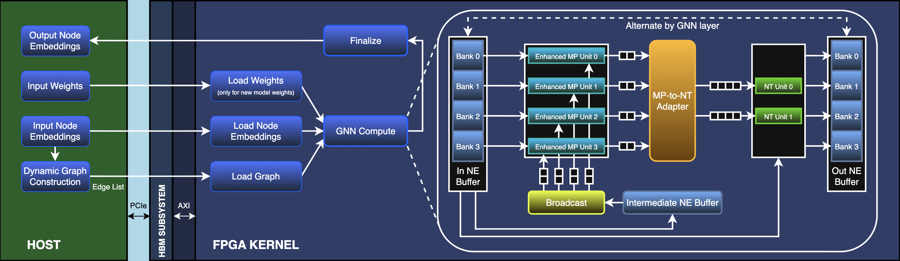

# DGNNFlow

This repository contains implementation for *DGNNFlow*, a novel streaming dataflow architecture for real-time edge-based dynamic GNN inference.
The dataflow architecture of DGNNFlow is shown in the following diagram.

This repository contains two main directories:
1. DGNNFlow_HW/: this directory contains necessary files for implementation and use of DGNNFlow hardware architecture.
2. L1DeepMETv2_SW/: this directory contains necessary files for implementation and use of L1DeepMETv2 software model.

## DGNNFlow_HW

Structure of this directory for DGNNFlow architecture is as below:
* src/: this directory contains design source code for DGNNFlow.
* testbench/: this directory contains testbench code for DGNNFlow along with DELPHES weights for inference.
* edge_conv_compute_kernel.xclbin: this file is FPGA executable file of DGNNFlow architecture.
* Makefile: this file contains commands for compilation, linking, emulation, and complete execution of host-FPGA application for DGNNFlow.
* LatencyStats.csv: this CSV file contains statistics for FPGA latency benchmarking.
* Remaining files: these contain configuration and tracing files.

## L1DeepMETv2_SW

Structure of this directory for L1DeepMETv2 model is as below:
* L1DeepMETv2/: this directory contains source code of L1DeepMETv2 PyTorch model.
* weights_files_Delphes/: this directory contains DELPHES weights for inference.
* benchmark.py: this Python file contains code for performance benchmarking.
* power.py: this Python file contains code for measuring power consumption.
* Remaining files: these contain source code and compiled code for L1DeepMETv2 C++ model and Python binding.